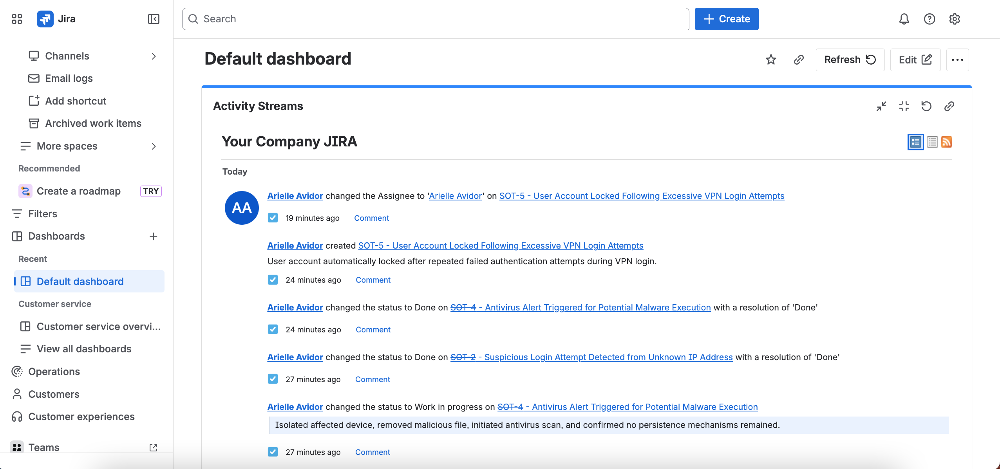
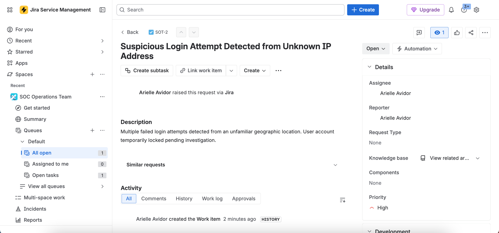
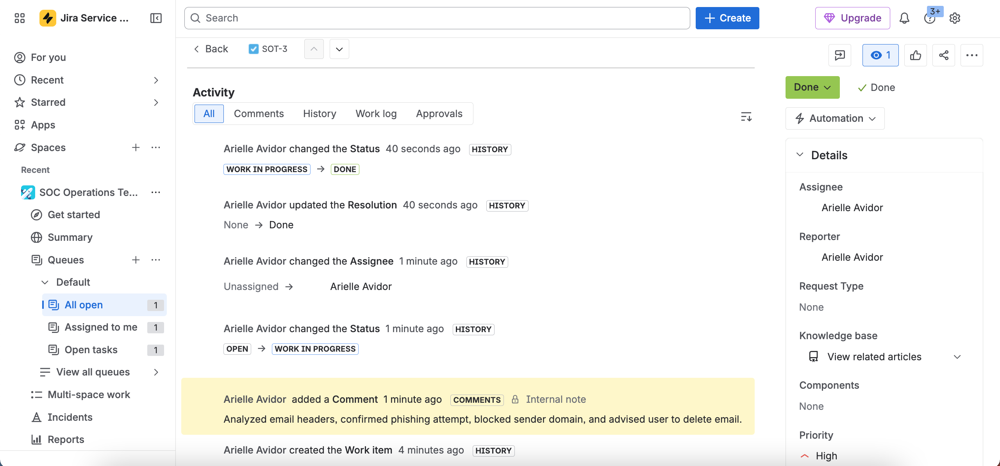
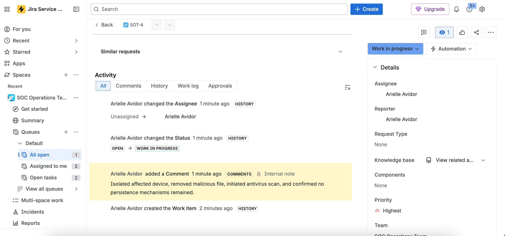
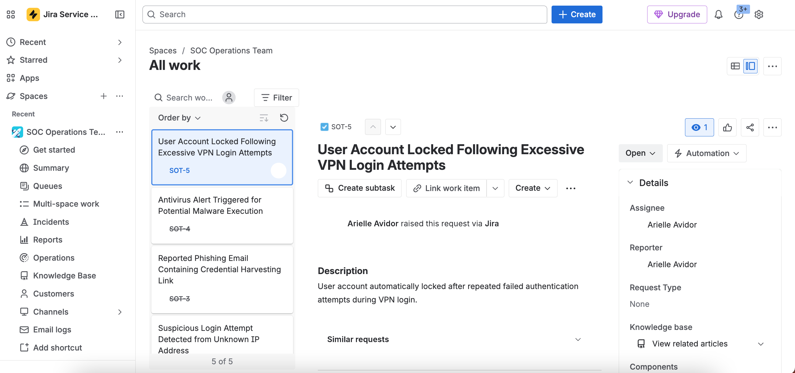
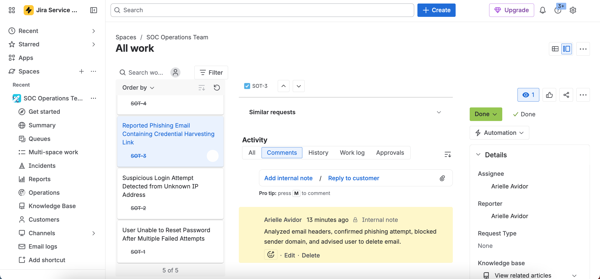

# SOC Incident Response Lab

## Overview

This project simulates a SOC (Security Operations Center) and IT support incident response workflow using Jira Service Management. The lab demonstrates how security incidents and support requests are tracked, documented, prioritized, and resolved within a ticketing environment.

The project focuses on practical SOC operations concepts including incident handling, workflow management, phishing investigations, malware response, account security, and ticket lifecycle documentation.

---

## Objectives

- Simulate real-world SOC and IT support ticket workflows
- Practice incident documentation and response procedures
- Demonstrate ticket lifecycle management and workflow progression
- Improve familiarity with Jira Service Management
- Strengthen hands-on cybersecurity operational experience

---

## Technologies Used

- Jira Service Management
- Incident Response Workflow
- Ticket Lifecycle Management
- Security Operations Procedures

---

## Simulated Incidents

### Password Reset Request
Simulated user account recovery and MFA reconfiguration following multiple failed login attempts.

### Suspicious Login Attempt
Investigated unauthorized login attempts from an unfamiliar geographic location and implemented account security measures.

### Phishing Email Investigation
Documented analysis of a phishing email impersonating internal IT support and recorded remediation actions.

### Malware Detection Incident
Simulated endpoint malware investigation including device isolation, malicious file removal, and antivirus remediation steps.

### Locked VPN Account
Simulated user account lockout following repeated failed VPN authentication attempts.

---

## Workflow Lifecycle

Tickets were managed through multiple workflow stages including:

- Open
- Work In Progress
- Done / Resolved

The workflow process demonstrates incident tracking, escalation, remediation documentation, and resolution management.

---

## Project Screenshots

### Jira Dashboard Activity

### Suspicious Login Investigation

### Phishing Incident Workflow

### Malware Incident Response

### Ticket Workflow Management

### Resolution Notes Documentation

---

## Key Takeaways

- Improved understanding of SOC and IT support workflows
- Practiced documenting incident response procedures
- Gained familiarity with ticket prioritization and lifecycle management
- Strengthened operational cybersecurity documentation skills
- Developed experience using Jira Service Management in a simulated SOC environment
